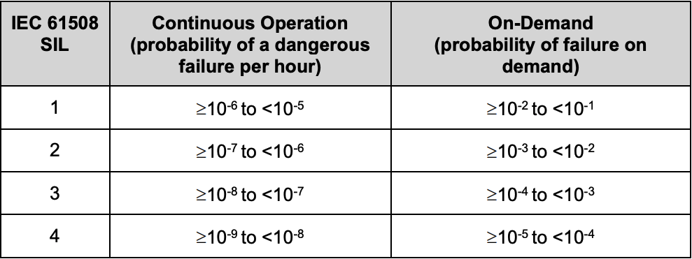
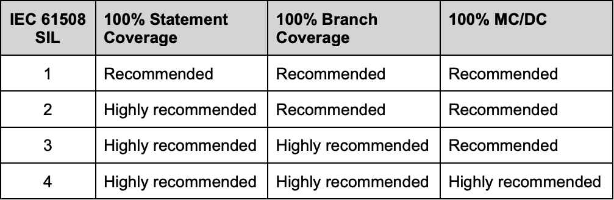

# Chapter 2: White-Box Test Techniques

## 2.8 Selecting a White-Box Test Technique

- [x] **Date Completed:** 11/01/2024 - **Understanding Level:** 😊

### Key Concepts

- White-box test techniques are selected based on required coverage levels.
- Black-box test techniques are usually applied first, and white-box testing is used if required coverage is not achieved.
- Specifying a white-box coverage level at 100% is good practice to ensure thorough testing.
- Lower coverage levels may leave complex and error-prone parts of code untested.
- ISO 29119-4 allows for discounting infeasible coverage items, making 100% coverage achievable.
- It's only necessary to specify a single coverage criterion at 100%.
- Different parts of a system may have different white-box coverage levels based on their risk contribution.
- API testing coverage increases with associated risk.
- Selection of white-box test technique depends on the nature of the test object and perceived risks.
- Regulatory standards define required white-box coverage levels for safety-related test objects.
- For non-safety-related test objects, coverage levels should be based on perceived risks.

### 2.8.1 Non-Safety-Related Systems

- [x] **Date Completed:** 11/01/2024 - **Understanding Level:** 😊

- Factors considered when selecting white-box test techniques for non-safety-related systems include:
  - Contract requirements for coverage
  - Customer requests for coverage
  - Regulatory standards in certain industry sectors
  - Alignment with the organization's test strategy
  - Coding style and complexity of the code
  - Historical defect data on achieving coverage levels
  - Tester skills and experience with white-box techniques
  - Availability of coverage measurement tools
- _Technical Test Analyst has more freedom to recommend white-box coverage for non-safety-related systems than for safety-related systems._
- Decisions on white-box testing coverage for non-safety-related systems are based on a compromise between perceived risks and the resources, cost, and time required for testing. Other testing approaches or development methods may be more suitable in some cases.

### 2.8.2 Safety-related systems

- [x] **Date Completed:** 11/01/2024 - **Understanding Level:** 😊

- For software in safety-related systems, regulatory standards define required coverage levels.
- Hazard analysis is performed to assess risks, and integrity levels are assigned to system parts.
- IEC 61508 is an international standard used for safety-related systems, but specific industry variants and standards exist (e.g., ISO 26262 for automotive, DO-178C for airborne software).
- IEC 61508 defines four safety integrity levels (SILs) based on risk reduction and hazard severity.

  

- Higher-risk functions require higher reliability, and SIL 4 demands extremely high reliability.
- Recommendations for white-box coverage levels vary for each SIL, with some being highly recommended (often considered mandatory) and others just recommended (optional with a rationale). SIL 3 typically requires 100% branch coverage and automatically achieves 100% statement coverage.

  

- Note that the above SILs and requirements on coverage levels from IEC 61508 are different in ISO
  26262, and different again in DO-178C.

---

[Previous Page](2.7-api-testing.md) | [Next Page](../3-static-and-dynamic-analysis/3.1-introduction.md)
