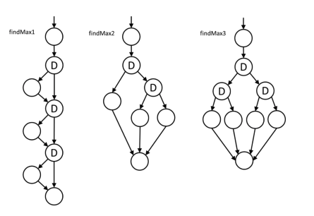

# Technical Test Analyst Exam

## [TTA-3.2.1: Control Flow Analysis](../../3-static-and-dynamic-analysis/3.2-static-analysis.md#321-control-flow-analysis)

### Question #12 (2 Points) - K3

The programmers have designed three versions of a function that finds the largest number among three integers: findMax1, findMax2 and findMax3. One of them must be chosen for the next release. The codes look as follows:

```javascript
int findMax1(n1, n2, n3) {
  let max;
  if (n1 >= n2 && n1 >= n3) {
    max = n1;
  }
  if (n2 >= n1 && n2 >= n3) {
    max = n2;
  }
  if (n3 >= n1 && n3 >= n2) {
    max = n3;
  }
  return max;
}
```

```javascript
int findMax2(n1, n2, n3) {
  let max;
  if (n1 >= n2 && n1 >= n3) {
    max = n1;
  } else if (n2 >= n1 && n2 >= n3) {
    max = n2;
  } else {
    max = n3;
  }
  return max;
}
```

```javascript
int findMax3(n1, n2, n3) {
  let max;
  if (n1 >= n2) {
    if (n1 >= n3) {
      max = n1;
    } else {
      max = n3;
    }
  } else {
    if (n2 >= n3) {
      max = n2;
    } else {
      max = n3;
    }
  }
  return max;
}
```

**You were asked to select the one with the lowest cyclomatic complexity. Which ONE should you choose?**

    a. findMax1
    b. findMax2
    c. findMax3
    d. You can choose any of them, because all three functions have the same cyclomatic complexity

**Select ONE option.**

---

<details>
<summary><strong>Show Answer</strong></summary>

#### Correct Answer: b



The control flow graphs of all three functions are presented in the figure. One can see that findMax2 has 2 decision points (marked with symbol “D”), so its cyclomatic complexity equals 3, while findMax1 and findMax3 have 3 decision points, so their cyclomatic complexity equals 4. Hence:

Thus:

    a. Is not correct
    b. Is correct
    c. Is not correct
    d. Is not correct

</details>

---

[↑ Table of Contents](../../README.md#table-of-contents) | [← Previous Page](question-11.md) | [Next Page →](question-13.md)
