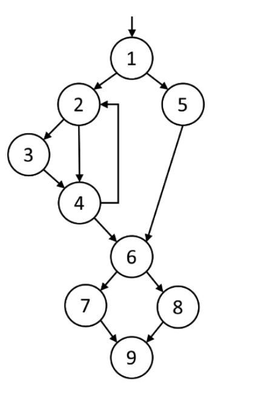

# Technical Test Analyst Exam

## [TTA-2.3: Decision Testing](../../2-white-box-test-techniques/2.3-decision-testing.md)

### Question #5 (2 Points) - K3

You are testing code whose control flow graph is presented below. Node 1 is the entry point and node 9 is the exit point.

**Assuming that all decisions in this code are independent, what is the minimum number of test cases required to achieve 100% decision coverage?**

    a. 2
    b. 3
    c. 4
    d. 5

**Select ONE option.**

---

<strong>Show Answer</strong>

#### Correct Answer: a

There are 4 decision points in the graph, in nodes `1`, `2`, `4` and `6`. Hence, we need to cover 8 decision outcomes: `TRUE` and `FALSE` for each of the four decisions.
These correspond to the branches `1→2, 1→5, 2→3, 2→4, 4→2, 4→6, 6→7, 6→8`. One test is not enough, because it will not be able to cover both `1→2` and `1→5`.
Two tests, however, will be enough;

- `1→2→3→4→2→4→6→7→9`
- `1→5→6→8→9`

The first test exercises decision outcomes `1→2, 2→3, 2→4, 4→2, 4→6, 6→7`. The second one exercises the decision outcomes `1→5, 6→8`. Hence, both tests cover all eight decision outcomes, achieving 100% decision coverage.

    a. Is correct
    b. Is not correct
    c. Is not correct
    d. Is not correct

---

[↑ Table of Contents](../../README.md#table-of-contents) | [← Previous Page](question-4.md) | [Next Page →](question-6.md)
